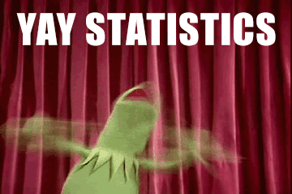
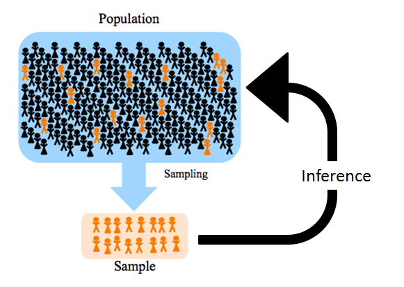
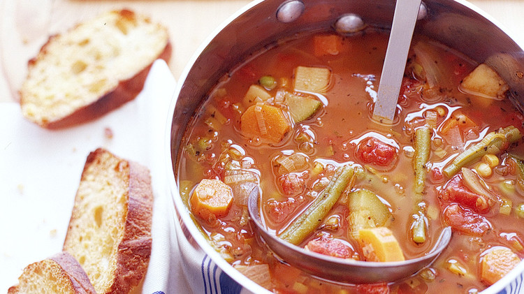
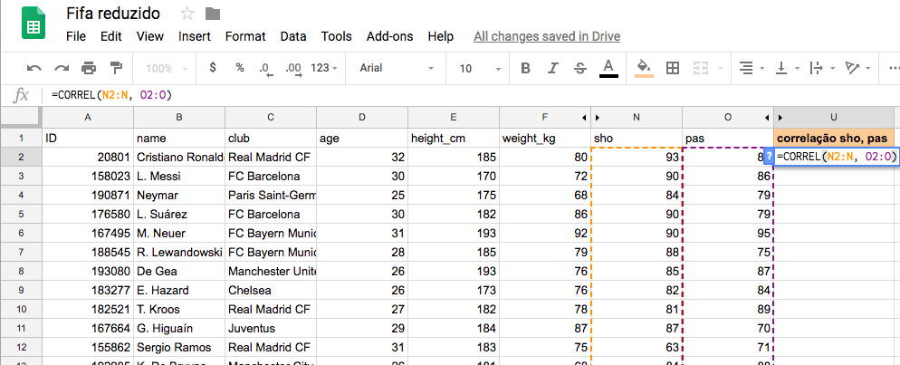
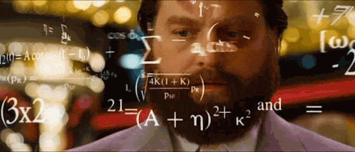
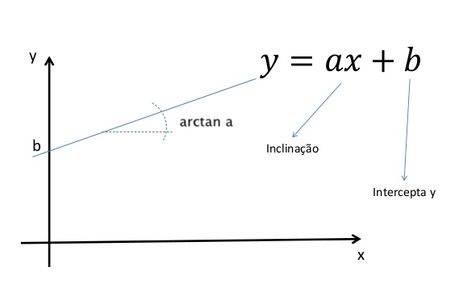
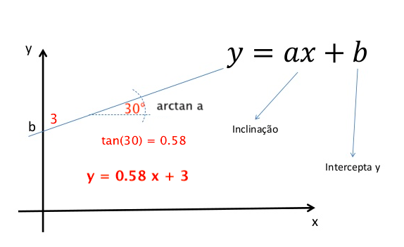
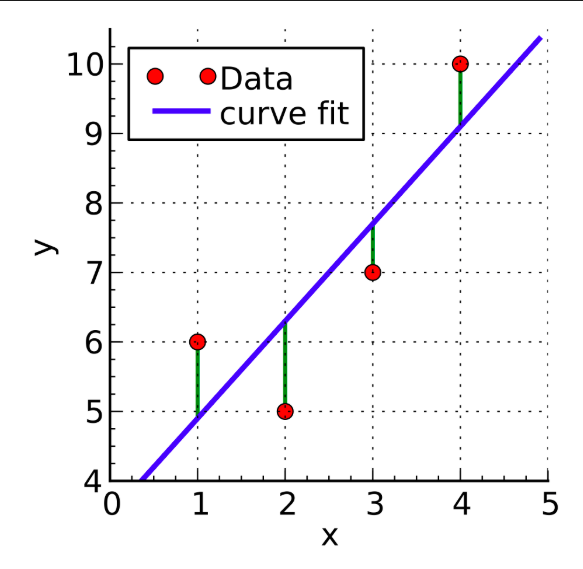
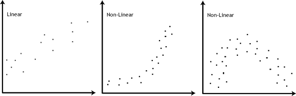
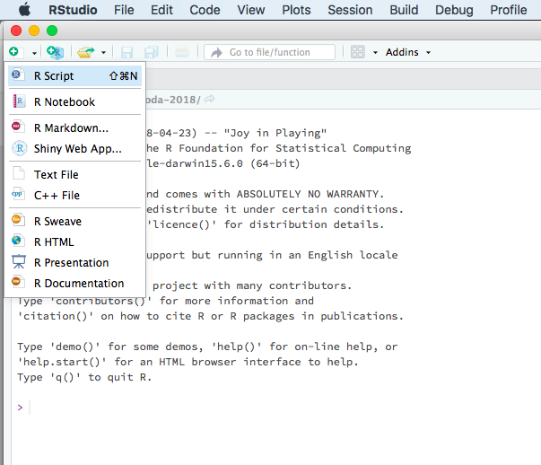

class: middle, center

# Sobre o Volt Data Lab
</img>


---

## Jornalismo + Dados
<br>
</img>
</img>
---
class: middle, center
# Vamos à *estatística*
</img>

</img>
---
## O que é **estatística**?
</img>
--
<br>
Organizar, descrever, analisar e interpretar dados
--
<br><br>
- Estatística descritiva (descrever e resumir dados)
- Probabilidade (teoria matemática para estudar a incerteza)
- Inferência estatística (extrapolação de informações e conclusões a partir dos dados)


---
## Falando em inferência...
</img>
--
<br>
Dois conceitos: **amostra** e **população**
--
<br><br>
### População
Conjunto de valores de uma característica observável associado a um grupo de indivíduos.<br>
Exemplo: idade dos brasileiros
--
<br><br>
### Amostra
Qualquer subconjunto de uma população.<br>
Exemplo: idade dos participantes do Coda; idade das pessoas neste workshop

---

## Mas e daí? 
</img>
--
<br>
Nem sempre é possível (ou desejável) obter informações diretamente da **população**.
Utilizamos **amostras** para fazer suposições sobre a população e estudar suas características.
--
<br><br>
A **inferência** tem como objetivo estudar generalizações sobre uma população através de evidências fornecidas por uma amostra dessa população, inclusive medindo quão *incerta* é a generalização.

</img>

---

## Suponha que você está fazendo uma sopa...
</img>

</img>

---
<br><br>
### Como você sabe se a sopa precisa de mais sal?
</img>
--
<br>
Tomar a sopa inteira?<br>
--
Experimentar uma colher?

--
<br>
### Depois de adicionar o sal, o que garante que a sopa como um todo estará mais salgada?
--
<br>
Misturamos a sopa para que ela fique *homogênea* e, assim, qualquer *amostra* que retirarmos dela para experimentar seja representativa do todo.

---
## Resumindo:
</img>

População a ser estudada <br><br>
$\downarrow$ <br><br>
Retira-se amostra(s) <br><br>
$\downarrow$ <br><br>
Análise do conjunto de dados e conclusões!<br><br>
$\downarrow$ <br><br>
Extrapolação de informações e conclusões sobre a amostra à população, *com um grau de incerteza*

---
class: middle, center
# Alguns conceitos importantes
</img>
---
### Média
</img>
--
<br>
$\bar X = \frac{(X_1 + X_2 + X_3 + ... + X_N)}{N}$

--
<br>
### Variância
--
<br>
$Var(X) = \frac{(X_1 - \mu)^2 + ( X_2 - \mu)^2 + ... + (X_n - \mu)^2}{N}$
--
<br>
### Correlação (Pearson)
--
<br>
$\rho_{X,Y} = \frac {cov(X,Y)}{\sqrt {var(X) \: var(Y)}} = \frac {\sum_{i=1}^n (x_i-\bar x)(y_i - \bar y)}{\sqrt {var(X) \: var(Y)}}$

---
## Mas, na prática...
</img>

`> mean(x)`<br>
`> var(x)`<br>
`> cor(x,y)`

</img>

---
## Resumindo:
</img>
--
<br>
</img>
<br><br>
Qualquer calculadora faz contas. <br>O importante é entender o que está acontecendo!

---
class: middle, center

# Regressão linear simples
</img>
---
## O que é regressão linear?
</img>
--
Técnica para __quantificar__ a mudança observada em uma variável quando variamos o valor de outra.<br>
--
```{r echo=FALSE, message=FALSE, fig.height = 5, fig.width = 9, fig.align = "center"}
library(tidyverse)
library(ggplot2)
dados <- read_csv("dados/fifa_reduzido.csv")
dados %>% ggplot() +
  geom_point(aes(x = pas, y = sho)) +
  geom_smooth(aes(x = pas, y = sho),method = "lm", formula = y ~ x, color = "red") +
  labs(x = "pass", y = "shoot", title = "FIFA 2018") +
  theme_bw()
```


Dados: https://www.kaggle.com/vmhatre7686/linear-regression-problems/data
---
## Motivação
</img>

Se eu sei que um jogador tem o atributo `pass` igual a 80, quanto espera-se que seja o seu atributo `shoot`?

--

## O que queremos

Prever valores de uma variável (resposta) em função de outra (explicativa)

--
## Ideia

Ajustar uma equação de reta de forma a minimizar a soma do quadrado das distâncias de cada ponto à reta

---

## Peraí, equação de reta?

</img>
--
Y = **a**X + **b**

em que

- **a** é o *coeficiente angular*
- **b** é o *coeficiente linear* ou *intercepto*
--

</img>
---
## Peraí, equação de reta?
</img>

Y = **a**X + **b**

em que

- **a** é o *coeficiente angular*
- **b** é o *coeficiente linear* ou *intercepto*

</img>

---

## Voltando à regressão
</img>

$$Y = a\,X + b + erro$$

O método de regressão linear estima os coeficientes $a$ e $b$, a partir dos pares $(X, Y)$ observados, em que

* __X__ é a variável explicativa
* __Y__ é a variável resposta
* __erro__ é a diferença entre o valor esperado e o valor observado, para cada par (X, Y)

No nosso caso, queremos encontrar o valor de `sho` (Y) em função de `pas` (X) <br>

---
## E por que __essa__ reta?
</img>

```{r echo=FALSE, message=FALSE, fig.height = 6, fig.width = 9, fig.align = "center"}
library(tidyverse)
library(ggplot2)
dados <- read_csv("dados/fifa_reduzido.csv")
dados %>% ggplot() +
  geom_point(aes(x = pas, y = sho)) +
  geom_smooth(aes(x = pas, y = sho),method = "lm", formula = y ~ x, color = "red") +
  labs(x = "pass", y = "shoot", title = "FIFA 2018") +
  theme_bw()
```
---

## Não poderia ser a reta azul?
</img>

```{r echo=FALSE, message=FALSE, fig.height = 6, fig.width = 9, fig.align = "center"}
dados %>% ggplot() +
  geom_point(aes(x = pas, y = sho)) +
  geom_smooth(aes(x = pas, y = sho),method = "lm", formula = y ~ x, color = "red") +
  geom_abline(intercept = 15, slope = 0.65, color = "blue", size = 1.4) +
  labs(x = "pass", y = "shoot", title = "FIFA 2018") +
    theme_bw()
```

---
## Ou a verde?
</img>

```{r echo=FALSE, message=FALSE, fig.height = 6, fig.width = 9, fig.align = "center"}
dados %>% ggplot() +
  geom_point(aes(x = pas, y = sho)) +
  geom_smooth(aes(x = pas, y = sho),method = "lm", formula = y ~ x, color = "red") +
  geom_abline(intercept = 15, slope = 0.65, color = "blue", size = 1.4) +
  geom_abline(intercept = 3, slope = 0.9, color = "green", size = 1.4) +
  labs(x = "pass", y = "shoot", title = "FIFA 2018") +
  theme_bw()
```
---
## Minimizar a soma do quadrado das distâncias de cada ponto
</img>

A reta da regressão (vermelha) é a melhor reta entre todas, porque a soma do quadrado da _distância_ de cada ponto em relação a ela é a __menor possível__.
<br><br>
</img>

---
## "Beleza, já entendi o que é regressão! Mãos à obra"
</img>
--

</img>

---
## Suposições / hipóteses necessárias
</img>
### Relação *linear* entre duas variáveis numéricas 
Lembra do coeficiente de correlação de Pearson? Use-o. <br>

```{r}
var_explicativa <- c(1,2,3,4,5,6,7,8,9,10)
var_resposta <- c(1,3,7,8,12,12,14,15,17,22)
cor(var_explicativa, var_resposta, method="pearson")
```
--
- Quanto mais próximo de __1__: mais _positivamente_ correlacionados
- Quanto mais próximo de __-1__: mais _negativamente_ correlacionados
- Quanto mais próximo de __0__: ausência de correlação

---
## Suposições / hipóteses necessárias
</img>

Plotar os dados também ajuda a visualizar e ter uma ideia de como eles se relacionam.
--
```{r fig.align="center", fig.height=5}
plot(x = var_explicativa, y = var_resposta)
```
---
## Suposições / hipóteses necessárias
</img>
### Exemplos de relações linear e não lineares

</img>

---
## Suposições / hipóteses necessárias
</img>

### Distribuição normal dos erros
Erros são aleatórios, com média igual a zero e variância constante
```{r fig.height=4, fig.align="center"}
hist(rnorm(1000, mean=0, sd=1), prob=TRUE)
curve(dnorm(x, mean=0, sd=1), add = TRUE, col="red", lwd=2)
```
---
</img>
<br><br><br><br><br>
</img>
---
## Na prática, os dados são mais ou menos assim...

</img>

</img>

---
## ...e não assim
</img>

</img>

---
class: middle, center

# Agora sim: vamos ao _RStudio_ !
</img>

---
## Abra o RStudio e crie um novo script
</img>

</img>

---
## Vamos dar uma olhada nos dados
</img>

```{r}
# Carregando os dados
dados <- read.csv("dados/fifa_reduzido.csv")

# Vamos dar uma olhada nas primeiras linhas
head(dados)
```
---
## Quanta coisa... Vamos ver só o nome, 'sho' e 'pas'?
</img>
```{r}
dados2 <- data.frame(nome = dados$name, sho = dados$sho, pas = dados$pas)
head(dados2)

```
---
## Plotando sho X pas
</img>

```{r fig.align="center", fig.height=5}
plot(x = dados2$pas, y = dados$sho)
```
Parece linear! E _homoscedástico_

---
## Adicionando a reta de regressão
</img>

```{r fig.align="center", fig.height=5}
plot(x = dados2$pas, y = dados$sho)
abline(lm(dados2$sho ~ dados2$pas), col="red")
```

---
## Valores de __a__ e __b__
</img>

```{r}
lm(dados$sho ~ dados2$pas)
```
--
### Interpretação
- __a__ (coeficiente angular): quanto a variação de `sho` influencia em `pas`
- __b__ (intercepto): valor esperado de `sho` quando `pas` é igual a zero

---
## Alguns métodos de avaliação de qualidade do ajuste
</img>

- Coeficiente de determinação $R^2$
- Gráficos de resíduos padronizados
- Distância de Cook

https://www.statmethods.net/stats/rdiagnostics.html

---
## Coeficiente de determinação $R^2$
</img>

$$R^2 = \frac{SQReg}{SQTot} = 1 -\frac{SQRes}{SQTot}$$
em que <br><br>
$SQTot = \sum_{i=1}^n (y_i - \bar y)^2$ <br>
$SQReg = \sum{i=1}^n (\hat y_i - \bar y)^2$ <br>
$SQRes = \sum{i=1}^n (y_i - \hat y_i)^2$

--
<br><br><br>
</img>

---

## Coeficiente de determinação $R^2$
</img>

O Coeficiente de determinação $R^2$ mede o quanto da variabilidade da resposta é explicada pela regressão

```{r}
fit <- lm(dados2$sho ~ dados2$pas)
summary(fit)$r.squared
```
---
## Distância de Cook
</img>

```{r fig.height = 5, fig.align="center"}
plot(fit, which=4)
```
<br>
Valores que se destacam no gráfico são chamados _pontos de alavanca_ e devem ser investigados

---
## Ex: área e valor de imóveis
</img>

```{r echo=FALSE, message=FALSE, fig.show = "hold",fig.align="center"}
dados <- read_csv("dados/imob.csv")
t1 <- dados %>% head(10)
t2 <- dados %>% tail(10) 
knitr::kable(list(t1,t2), format = "html")

```
---
class: middle, center
## Tentem ajustar uma reta de regressão no R!

</img>

arquivo `imob.csv`
---
## Regressão linear: preço e área de imóveis
</img>

```{r echo=FALSE, message=FALSE, fig.align="center"}

dados %>% ggplot() +
  geom_point(aes(x = area, y = valor)) +
  geom_smooth(aes(x = area, y = valor),method = "lm", formula = y ~ x, color = "red") +
  labs(x = "Área do imóvel (em metros quadrados)", y = "Valor do imóvel (em milhares de reais)") +
  theme_bw()

```

---
# Referências
</img>


* __Noções de Probabilidade e Estatística__<br>
  Marcos Nascimento Magalhães e Antonio Carlos Pedroso de Lima<br>
  https://www.ime.usp.br/~noproest
  
* __Penn State__ <br>
  Curso STAT 414 <br>
  https://onlinecourses.science.psu.edu/stat414/

* __Linear regression in real life__<br>
  https://link.medium.com/JTDsTwbZAR

---
class: middle, center
# Obrigada!
</img>
[@renata_mh](https://twitter.com/renata_mh)<br>
renata@voltdata.info<br>

https://www.voltdata.info